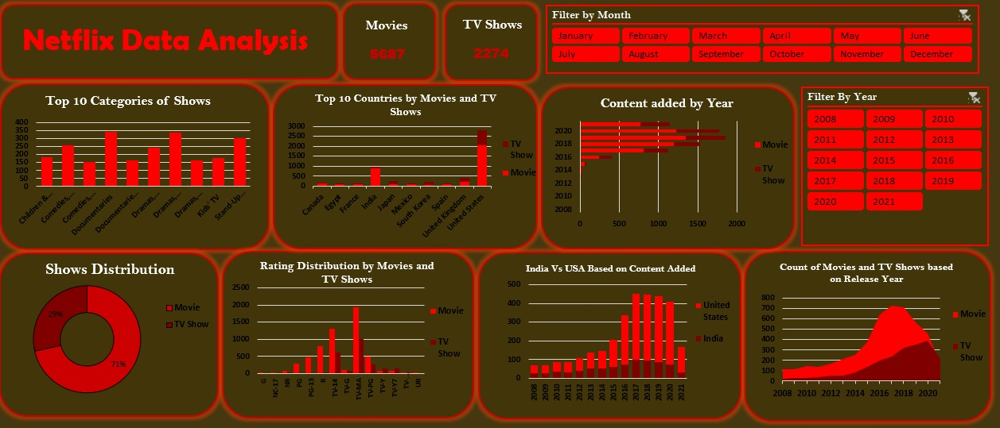

# 🎬 Netflix Data Analysis Dashboard using Microsoft Excel


---

# 📌 Project Overview

The **Netflix Data Analysis Dashboard** is an end-to-end data analysis project developed using **Microsoft Excel**. The project transforms raw Netflix Movies and TV Shows data into an interactive dashboard that provides meaningful insights into Netflix's content library.

The dashboard enables users to analyze Movies and TV Shows based on categories, countries, ratings, release years, and content additions through interactive filters.

---

# 🎯 Project Objectives

The objectives of this project are to:

- Clean and preprocess raw Netflix data.
- Analyze Movies and TV Shows available on Netflix.
- Build an interactive dashboard using Excel.
- Discover content trends using visualizations.
- Generate actionable business insights.
- Demonstrate Excel skills required for Data Analyst roles.

---

# 🔄 Project Workflow

```
Raw Netflix Dataset
        │
        ▼
Data Cleaning & Preprocessing
        │
        ▼
Feature Engineering
(Year Added, Month Added)
        │
        ▼
Pivot Tables
        │
        ▼
Pivot Charts
        │
        ▼
Interactive Dashboard
        │
        ▼
Business Insights & Conclusions
```

---

# 📂 Dataset Information

Dataset: **Netflix Movies and TV Shows**

The dataset contains information about Netflix titles including:

| Column | Description |
|---------|-------------|
| Show ID | Unique identifier |
| Type | Movie or TV Show |
| Title | Name of the title |
| Director | Director(s) |
| Cast | Main actors |
| Country | Production country |
| Date Added | Date added to Netflix |
| Release Year | Original release year |
| Rating | Content maturity rating |
| Duration | Runtime or Seasons |
| Listed In | Genre/Category |

---

# 🧹 Data Cleaning Process

The following preprocessing steps were performed before analysis:

- Removed duplicate records.
- Trimmed extra spaces using **TRIM()**.
- Formatted the **Date Added** column into a proper date format.
- Extracted **Year Added**.
- Extracted **Month Added**.
- Checked for missing values.
- Standardized text formatting.
- Created Pivot Tables for analysis.

---

# 🛠️ Excel Functions Used

The project uses the following Excel functions:

| Function | Purpose |
|----------|---------|
| TRIM() | Remove extra spaces |
| YEAR() | Extract year |
| TEXT() | Extract month name |
| LEN() | Count characters |
| SUBSTITUTE() | Replace text |
| COUNTIF() | Count specific values |
| SUM() | Total calculations |
| IF() | Conditional logic |

---

# 📊 Dashboard Components

The interactive dashboard consists of:

### KPI Cards

- Total Movies
- Total TV Shows

### Charts

- Top Categories of Shows
- Top 10 Countries by Movies & TV Shows
- Content Added by Year
- Shows Distribution
- Rating Distribution
- India vs USA Content Comparison
- Release Year Trend

### Interactive Filters

- Month Slicer
- Year Slicer

---

# 🖥 Dashboard Preview

> Save the dashboard screenshot inside the Images folder.

```
Images/
    dashboard-preview.png
```

Display using:

```markdown

```

---

# 📈 Key Performance Indicators (KPIs)

| KPI | Value |
|------|------:|
| Total Movies | 5,687 |
| Total TV Shows | 2,274 |
| Total Titles | 7,961 |
| Movies | 71% |
| TV Shows | 29% |

---

# ❓ Business Questions Answered

### 1. How many Movies and TV Shows are available on Netflix?

Displays the total number of Movies and TV Shows using KPI cards.

---

### 2. Which categories contain the highest number of titles?

Identifies the most common genres available on Netflix.

---

### 3. Which countries contribute the highest number of Netflix titles?

Ranks countries based on total Movies and TV Shows.

---

### 4. How has Netflix's content library grown over time?

Analyzes yearly additions to Netflix.

---

### 5. What percentage of Netflix's catalog consists of Movies versus TV Shows?

Compares the overall content distribution.

---

### 6. Which audience ratings are most common?

Shows the popularity of different content ratings.

---

### 7. How does Netflix content growth compare between India and the United States?

Compares yearly additions from both countries.

---

### 8. How has content production changed by release year?

Shows release trends across Movies and TV Shows.

---

# 📌 Key Insights

### 🎬 Movies dominate Netflix's content library.

Movies account for approximately **71%** of the available content, while TV Shows represent **29%**.

---

### 🌍 The United States is the largest content producer.

The United States contributes the highest number of titles, followed by India and the United Kingdom.

---

### 📚 Drama and Documentaries are among the most popular categories.

These genres consistently contain the highest number of titles.

---

### 📈 Netflix experienced rapid expansion after 2015.

A sharp increase in content additions is observed between **2016 and 2019**.

---

### ⭐ TV-MA is the most common content rating.

Netflix primarily offers content targeted toward mature audiences.

---

### 🇮🇳 India has shown consistent growth.

India continues to increase its contribution to Netflix's content library.

---

### 🎥 Most available titles were released between 2016 and 2020.

Netflix's catalog mainly consists of recent productions.

---

# 📊 Business Recommendations

Based on the analysis:

- Continue investing in high-performing genres such as Drama and Documentaries.
- Increase original productions in emerging markets to diversify the content library.
- Maintain a balanced mix of Movies and TV Shows to cater to varying audience preferences.
- Expand family-friendly content to attract a broader audience.
- Use regional trends to guide future content acquisition strategies.

---

# ⚠ Challenges Faced

During this project, the following challenges were encountered:

- Missing values in the Director, Country, and Cast columns.
- Multiple countries listed within a single record.
- Inconsistent text formatting.
- Date conversion issues.
- Selecting suitable chart types for effective visualization.
- Designing a clean, user-friendly dashboard layout.

---

# 🚀 Future Enhancements

Potential improvements include:

- Develop the dashboard in Power BI.
- Recreate the project in Tableau.
- Automate data cleaning using Power Query.
- Perform SQL-based preprocessing.
- Add KPIs such as:
  - Average Movie Duration
  - Top Directors
  - Top Actors
  - Genre Popularity by Country
- Implement predictive trend analysis.

---

# 📚 Learning Outcomes

This project strengthened my understanding of:

- Data Cleaning
- Data Preparation
- Exploratory Data Analysis (EDA)
- Excel Functions
- Pivot Tables
- Pivot Charts
- Dashboard Design
- Interactive Reporting
- Business Intelligence
- Data Visualization

---

# 💼 Skills Demonstrated

- Microsoft Excel
- Data Cleaning
- Data Analysis
- Exploratory Data Analysis (EDA)
- Pivot Tables
- Pivot Charts
- Interactive Dashboard Development
- Business Intelligence
- Data Visualization
- Analytical Thinking

---

# 📁 Repository Structure

```
Netflix-Data-Analysis-Excel
│
├── Dataset
│   └── netflix-titles.xlsx
│
├── Dashboard
│   └── netflix-dashboard.xlsx
│
├── Images
│   └── dashboard-preview.png
│
├── README.md
└── LICENSE
```

---

# 📌 Conclusion

This project demonstrates how Microsoft Excel can be used to build interactive Business Intelligence dashboards through data cleaning, exploratory data analysis, Pivot Tables, Pivot Charts, and dynamic filtering.

The dashboard transforms raw Netflix data into meaningful business insights, enabling users to explore trends in content distribution, genres, countries, ratings, and release patterns.

This project showcases practical Excel and analytical skills that are directly applicable to real-world Data Analyst roles.

---

# 👩‍💻 Author

## Aysha Rafiya

**Aspiring Data Analyst**

### Skills

- Excel
- SQL
- Power BI
- Python (Learning)
- Data Visualization
- Business Intelligence

---

⭐ **If you found this project useful, please consider giving it a Star!**
